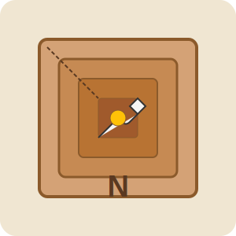

# Nougat 🍫

[](https://badge.fury.io/py/pynougat)
[](https://opensource.org/licenses/MIT)
[](https://pypi.org/project/pynougat/)
[](https://github.com/sphireinc/pynougat/actions/workflows/test-and-build.yml)

<div align="center">
    <br/>
    A lightweight type-safe Python utility for safely accessing deeply nested dictionary values.
</div>

## Overview

**Nougat** solves the common problem of accessing nested dictionary values without raising KeyError
exceptions. It provides high-performance nested dictionary access with a clean, type-safe interface
for traversing nested dictionaries, returning a default value when any key in the path doesn't exist. 
Stop worrying about KeyError exceptions and messy null checks!

## Problem

Working with nested dictionaries in Python often leads to verbose, error-prone code:

```python
# Deeply nested access without Nougat
data = {...}
user_city = None
if 'user' in data and data['user'] and 'profile' in data['user'] \
        and data['user']['profile'] and 'address' in data['user']['profile']:
    if 'city' in data['user']['profile']['address']:
        user_city = data['user']['profile']['address']['city']
```

Or risky code that might raise exceptions:

```python
# Error-prone approach
data = {...}
try:
    user_city = data['user']['profile']['address']['city']
except (KeyError, TypeError):
    user_city = None
```

## Solution

**Nougat** provides a clean, performant way to safely access nested values:

```python
# With Nougat
from src import nougat

data = {...}
user_city = nougat(data, "user", "profile", "address", "city", default="Unknown")
```


## Installation

via pip:

```bash
pip install pynougat
```

via git+pip:

```bash
# Clone the repository
git clone https://github.com/sphireinc/pynougat.git

# Install directly with pip
pip install git+https://github.com/sphireinc/pynougat.git
```

## Usage

### Basic Usage

```python
from src.pynougat import nougat

# Sample nested data
data = {
    "user": {
        "profile": {
            "name": "Alice",
            "address": {
                "city": "Seattle",
                "zip": "98101"
            }
        },
        "preferences": {
            "theme": "dark"
        },
        "scores": [85, 92, 78]
    }
}

# Simple path traversal
name = nougat(data, "user", "profile", "name")  # "Alice"

# Default values for missing paths
country = nougat(data, "user", "profile", "address", "country", default="USA")  # "USA"

# Access list items
second_score = nougat(data, "user", "scores", 1)  # 92

# Path doesn't exist? No problem!
missing = nougat(data, "user", "profile", "age", default=0)  # 0
```

### Advanced Features

#### Dot Notation

```python
from src.pynougat import nougat

# Use dot strings for cleaner access
theme = nougat(data, "user.preferences.theme", separator=".")  # "dark"
```

#### Alternative Keys

```python
from src.pynougat import nougat

# Try multiple keys at each level and use first match
theme = nougat(data, ("users", "user"), "preferences", ("appearance", "theme"))
```

#### Value Transformation

```python
from src.pynougat import nougat

# Transform the returned value
scores_sum = nougat(data, "user", "scores", transform=sum)  # 255 (85+92+78)
```

#### Path Caching for High Performance

```python
from src.pynougat import nougat_cached

# Create a reusable, cached accessor function for a specific path
data1 = {}
data2 = {}
get_user_city = nougat_cached(["user", "profile", "address", "city"])

# Use it repeatedly for high performance
city1 = get_user_city(data1)
city2 = get_user_city(data2)
```

#### Strict Type Checking

```python
from src.pynougat import nougat

# Enable strict type checking for better error identification
nougat(data, "user", "profile", "address", strict_types=True)
```

## Features

- Zero dependencies - just pure Python
- ⚡ **Highly optimized** for performance
- 🛡️ **Type-safe** with full mypy support
- 🧠 **Smart traversal** of dicts, lists, tuples, and custom objects
- 🔄 **Alternative paths** to try multiple access routes
- 🔍 **Dot notation** support for concise access patterns
- 🚀 **Path caching** for repeated high-performance lookups
- 🪄 **Value transformation** to process retrieved values
- 🔒 **Never raises exceptions** for a clean, predictable API
- Customizable default values
- Handles any depth of nesting
- Lightweight and fast

## When to Use Nougat

- Accessing configuration values that might not exist
- Processing API responses with varying structures
- Handling user input or preferences with optional fields
- Any situation where you need to safely navigate nested dictionaries

## Performance

**Nougat** is optimized for high performance:

- Fast paths for common data types
- Minimal overhead for common operations
- Path caching for repeated access
- Exception-free operation

## License

MIT License - See LICENSE file for details.

## Contributing

Contributions are welcome! Please feel free to submit a Pull Request.

1. Fork the repository
2. Create your feature branch (`git checkout -b feature/amazing-feature`)
3. Commit your changes (`git commit -m 'Add some amazing feature'`)
4. Push to the branch (`git push origin feature/amazing-feature`)
5. Open a Pull Request

---

Made with ❤️ for all Python developers tired of KeyError exceptions and messy `data.get('obj', {}).get('key', None)` chains